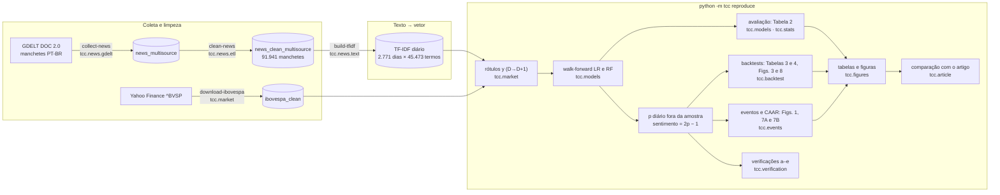

# Análise do Sentimento de Notícias e seu Efeito no Ibovespa

**Artigo:** *Análise do Sentimento de Notícias e seu Efeito no Ibovespa: Um Estudo Empírico com
Baselines Transparentes* — XXIX SemeAd (2026), artigo 160.
**Trabalho de Conclusão de Curso:** MBA em Business Intelligence & Analytics — ECA/USP.
**Autor:** Anderson Pantoja Machado · **Orientador:** Prof. Vinicius Rocha Biscaro

**Versão do código usada no artigo:** release [`v1.0-semead2026`](https://github.com/AndersonPM15/tcc-usp-ibovespa-sentimento/releases/tag/v1.0-semead2026)
(commit `0b3f78b`). A versão atual reorganiza o código num pacote Python e reproduz os mesmos
números, o que é verificado por testes automáticos.

---

## Reproduzir o artigo

```bash
python3.11 -m venv .venv && source .venv/bin/activate   # Windows: .venv\Scripts\activate
pip install -e ".[dev]"
cp .env.example .env                                     # e preencha TCC_USP_BASE (pasta dos dados)

python -m tcc reproduce                                  # Tabelas 1–4, Figuras 1–9 e verificações a–e
pytest                                                   # testes, incluindo a regressão do artigo
```

O `reproduce` lê **três arquivos de entrada** (ver [`data/MANIFEST.md`](data/MANIFEST.md)),
grava as tabelas e figuras em `reports/figures/`, as verificações em `reports/verificacao/` e
compara cada item com o número publicado. Leva cerca de 2,5 minutos. Se algo divergir, ele
aponta o item e encerra com erro.

```
[OK] Tabela 1 … [OK] Tabela 2 … [OK] Tabela 3 … [OK] Tabela 4 …
[OK] Figuras 3 e 8 … [OK] Figura 4 … [OK] Eventos … [OK] Figura 7B …
```

---

## Arquitetura



| Etapa | Comando | Módulo | Entrada → saída |
|---|---|---|---|
| Coleta | `collect-news` | `tcc.news.gdelt` | API do GDELT → `data_raw/news_multisource.parquet` |
| Limpeza | `clean-news` | `tcc.news.etl` | → `data_interim/news_clean_multisource.parquet` |
| TF-IDF | `build-tfidf` | `tcc.news.text` | → `data_processed/tfidf_daily_matrix.npz` e `tfidf_daily_index.csv` |
| Mercado | `download-ibovespa` | `tcc.market` | Yahoo Finance → `data_processed/ibovespa_clean.csv` |
| Modelos e avaliação | `reproduce` | `tcc.models`, `tcc.stats` | Tabela 2 e série diária de p |
| Backtest | `reproduce` | `tcc.backtest` | Tabelas 3 e 4, Figuras 3 e 8 |
| Eventos | `reproduce` | `tcc.events` | Figuras 1, 7A e 7B |
| Figuras | `reproduce` | `tcc.figures` | `reports/figures/` |
| Verificações | `reproduce` | `tcc.verification` | `reports/verificacao/` |
| Configuração | — | `tcc.config`, `tcc.datasets` | `TCC_USP_BASE` (`.env`), período e semente |

A coleta do GDELT não é determinística (a API pode responder diferente em datas diferentes).
Por isso o artigo é reproduzido a partir da base já coletada, identificada no manifesto pelo
SHA-256. A partir das notícias limpas, todo o caminho até a matriz TF-IDF é reproduzido sem
nenhuma diferença.

---

## O que o pipeline faz

1. **Notícias:** manchetes em português do GDELT, de 02/01/2018 a 19/11/2025: 91.941 manchetes
   de 508 domínios, após deduplicação pela URL normalizada (ou data + título, sem URL).
2. **Pré-processamento:**
   - remoção de URLs, e-mails e números;
   - minúsculas e só letras;
   - stopwords do NLTK.

   Não há lematização: na rodada do artigo, o spaCy não estava instalado e o código caiu nesse
   caminho, o único mantido.
3. **TF-IDF:**
   - um documento por dia, com as manchetes do dia concatenadas;
   - `min_df=2`, `max_df=0.95`, n-gramas 1–2, sem limite de termos (45.473 termos).
4. **Escore:** dois classificadores preveem a alta do Ibovespa de D para D+1 só com o TF-IDF
   do dia D:
   - Regressão Logística (`saga`, L2, C=1, `class_weight="balanced"`);
   - Random Forest (200 árvores, profundidade máxima 5).

   As probabilidades *p* são fora da amostra, em *walk-forward* com janela expansiva: treino
   inicial de 390 pregões e 4 blocos de teste de 388, sem embargo. O sentimento diário é
   **2p − 1**.
5. **Análises:** correlação, backtests e estudo de eventos em 05/08/2019–30/12/2024 (1.341 dias).

> **Rótulos no artigo:** as séries chamadas de "média simples do sentimento" e "média ponderada
> por volume" são, respectivamente, a **Regressão Logística** e o **Random Forest**. O código
> não agrega notícias nem pondera por volume.

### Como cada resultado é calculado

| Resultado | Arquivo em `reports/figures/` | Cálculo |
|---|---|---|
| Tabela 1 | `Tabela_1_amostra.csv` | 1.737 pregões (2018–2024); 1.341 dias com sentimento |
| Tabela 2 | `Tabela_2_auc_mda.csv` (valores completos em `Tabela_2_auc_mda_valores.csv`) | 1.552 dias fora da amostra (05/08/2019–17/11/2025). MDA = acurácia de (p ≥ 0,5). IC 95% por bootstrap i.i.d. (1.000 reamostragens, semente 42) |
| Tabela 3 | `Tabela_3_backtest_padrao.csv` | Compra se p ≥ quantil 0,90 de p no período inteiro; vende se p ≤ mediana; posição aplicada com lag + 1 dia (lag 0); custo de 0,0005 por turnover. Benchmark: buy-and-hold de 2018 a 2024 |
| Tabela 4 | `Tabela_4_robustez_backtest.csv` | Mesma regra, quantis 0,90 e 0,95 e lags 0, 1 e 2 |
| Figura 1 | `Figura_1_ibov_eventos.png` | Eventos de sentimento extremo com \|CAR\| no percentil 90 ou acima |
| Figura 3 | `Figura_3_comparativo_modelos.*` | Sharpe da regra `long_only_60`: compra se p ≥ 0,60, vende se p ≤ 0,40 |
| Figura 4 | `Figura_4_dispersao_sentimento_retorno.png` | Pearson entre o sentimento da LR e o retorno do **mesmo dia** (D−1 → D) |
| Figura 7B | `Figura_7B_event_time_CAAR.*` | Eventos = média do sentimento dos dois modelos no percentil 90 ou acima, ou no 10 ou abaixo. CAR = soma dos retornos brutos de D0 até D0+τ **dias corridos** |
| Figura 8 | `Figura_8_backtest_vs_benchmark.*` | Curvas da regra `long_only_60` e do Ibovespa nos mesmos 1.341 dias |

Métricas: Sharpe com 252 pregões por ano, sem taxa livre de risco; CAGR com 252 pregões por
ano.

**Exceção documentada — Figura 7B:** no artigo, o bootstrap dos ICs não tinha semente. O código
usa a semente 42, então os ICs podem diferir dos publicados a partir da 3ª casa decimal (a
comparação aceita 0,0025 nas médias e 0,01 nos ICs). No grupo positivo em τ = 4 (15 eventos),
o limite superior do IC muda de sinal conforme o sorteio.

### Comportamentos do artigo preservados

Corrigi-los mudaria os números publicados, então o padrão os mantém. Todos estão documentados
no código e cobertos por teste:

- **"None" no texto:** o coletor grava o texto em `text_full`, mas a limpeza procurava `text` e
  gravou "None" em todas as manchetes. Isso gera 4.035 bigramas espúrios (8,9% do vocabulário).
  Sem o "None", a AUC fica em 0,500 (LR) e 0,497 (RF), contra 0,502 e 0,491: a conclusão não
  muda (`tcc.news.text.daily_documents(missing_text="")`).
- **Limiares da Tabela 4 com informação futura:** os quantis vêm do período inteiro. A
  verificação (c) usa os 60 pregões anteriores.
- **Janela de eventos em dias corridos e retornos brutos.** A verificação (d) usa pregões e
  retorno anormal.

---

## Dados

Os dados não são versionados (licenças das fontes de notícias). O manifesto
[`data/MANIFEST.md`](data/MANIFEST.md) lista cada arquivo com origem, período, número de linhas
e SHA-256; `python -m tcc manifest --check` confere a sua pasta. Para reproduzir o artigo
bastam, em `data_processed/`:

| Arquivo | Conteúdo | Como obter |
|---|---|---|
| `ibovespa_clean.csv` | Ibovespa diário, 02/01/2018–18/11/2025 (1.960 pregões) | `python -m tcc download-ibovespa` (o download reproduz o arquivo do artigo) |
| `tfidf_daily_matrix.npz`, `tfidf_daily_index.csv` | TF-IDF diário (2.771 dias × 45.473 termos) | `python -m tcc build-tfidf` a partir das notícias limpas |

---

## Verificações pós-submissão

**Pós-submissão; não consta do artigo.** Em [`reports/verificacao/`](reports/verificacao/README.md)
há cinco análises feitas depois da submissão, com as mesmas previsões:

- **(a)** benchmark no mesmo período das estratégias;
- **(b)** H1 com IC por bootstrap em blocos, Newey-West e ADF/KPSS;
- **(c)** backtest sem *look-ahead*;
- **(d)** eventos com retorno anormal e janela em pregões;
- **(e)** modelo técnico e texto + técnico.

Elas confirmam as conclusões centrais: não há poder preditivo nem valor econômico. Também
mostram dois pontos que não se sustentam:

- o r ≈ −0,13 é contemporâneo e significativo, não preditivo;
- o CAAR negativo em τ = 4 da Figura 7B.

---

## Qualidade

| Verificação | Comando |
|---|---|
| Lint (regras B, C4, D, E, F, I, N, PIE, PTH, RET, RUF, SIM, UP, W) | `ruff check .` e `ruff format --check .` |
| Tipos | `mypy` |
| Código morto | `vulture` |
| Testes (unitários com dados sintéticos + regressão do artigo e das verificações) | `pytest` |

O GitHub Actions roda tudo isso a cada push (`.github/workflows/ci.yml`). Sem os dados, os
testes de regressão são pulados com aviso, e os unitários rodam com dados sintéticos. Antes de
cada commit, `pre-commit install` ativa lint, tipos e o teste de reprodução do artigo.

**Padrões:**

- **Idioma:** nomes de funções, variáveis, módulos e testes em inglês, como no Python e nas
  bibliotecas. Comentários, docstrings, mensagens e documentação em português.
- **Formatação:** linhas de 100 colunas.
- **Versões de reprodução (2026):** fixadas no `pyproject.toml` e testadas com Python 3.11.15.

---

## Estrutura

```
src/tcc/               pacote: um módulo por etapa (ver Arquitetura)
  reference/           números, tabelas e séries publicados no artigo
tests/                 testes (pytest)
reports/figures/       tabelas e figuras do artigo (geradas pelo reproduce)
reports/verificacao/   verificações pós-submissão (geradas pelo reproduce)
data/MANIFEST.md       manifesto dos arquivos de dados
.env.example           modelo de configuração (TCC_USP_BASE)
```

Protótipos de desenvolvimento, notebooks, dashboard e relatórios de 2025 estão preservados na
release `v1.0-semead2026` (o dashboard também na tag `v1.0-dashboard`).

---

## Licença e citação

Código sob licença MIT (`LICENSE`). Os dados de notícias pertencem às respectivas fontes e não
são redistribuídos.

MACHADO, Anderson Pantoja. Análise do Sentimento de Notícias e seu Efeito no Ibovespa: Um
Estudo Empírico com Baselines Transparentes. In: XXIX SemeAd — Seminários em Administração
FEA-USP, 2026. Artigo 160.
